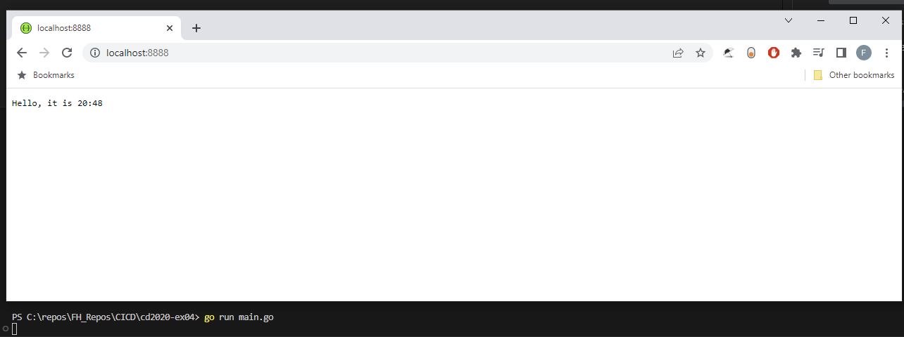
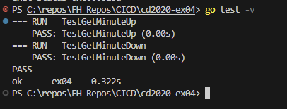
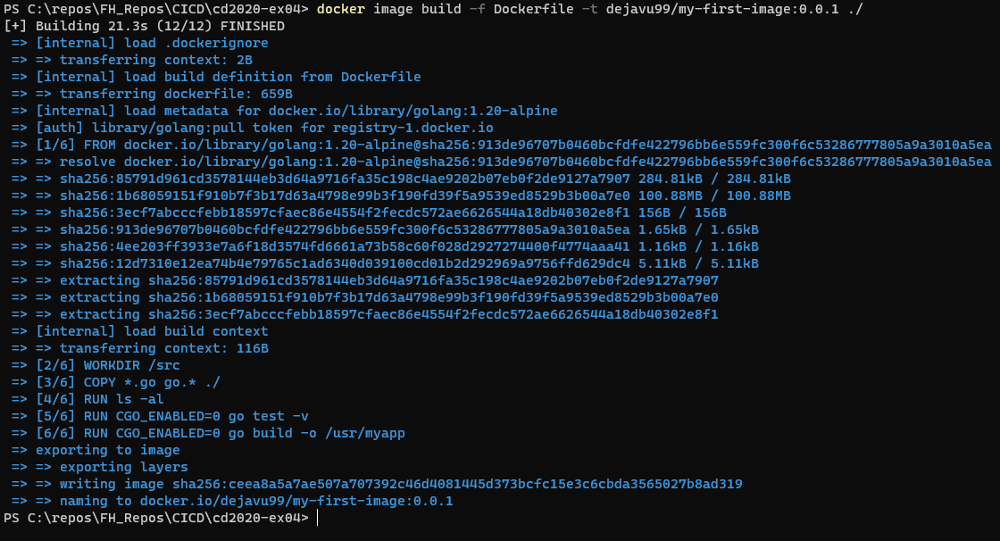
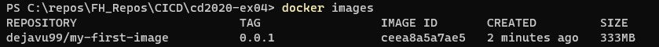
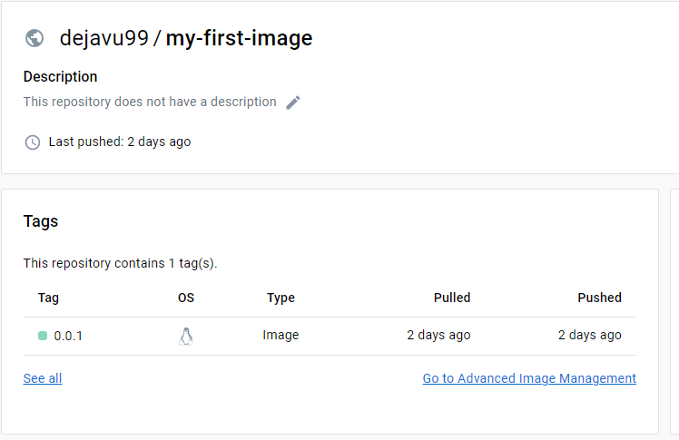
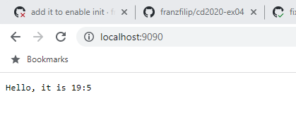
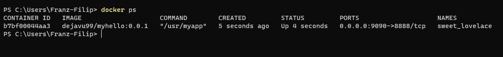
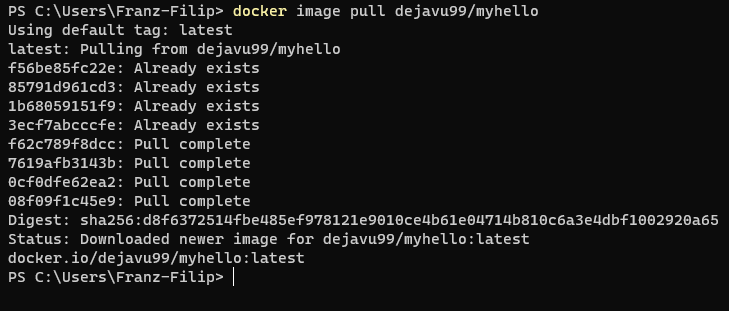
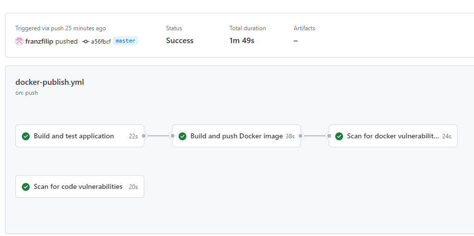
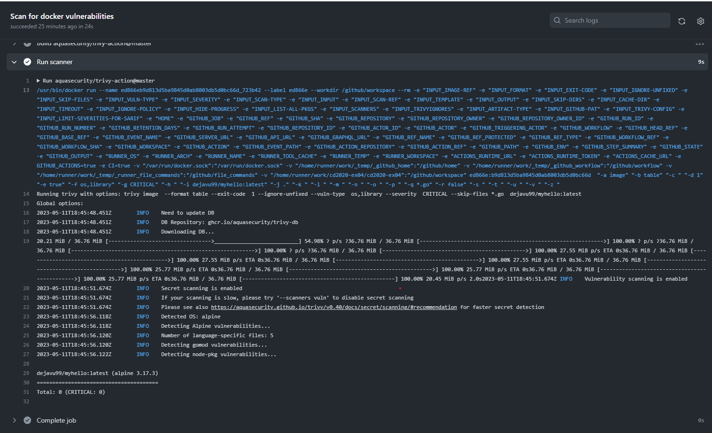

# Exercise 4

## Part 1

### 1. Check if the go program runs locally

First create a go.mod file (go init [NAME]).

```bash
go run main.go
```



```bash
go test -v
```


### 2. Modify the dockerfile in the repo

```dockerfile
FROM golang:1.20-alpine

# Set maintainer label: maintainer=[YOUR-EMAIL]
LABEL maintainer="[s2210455001@fhooe.at]"

# Set working directory: `/src`
WORKDIR /src

# Copy local file `main.go` to the working directory
COPY *.go go.* ./

# List items in the working directory (ls)
RUN ls -al

# Execute mod init
# RUN go mod init ex04

# Execute tests
RUN CGO_ENABLED=0 go test -v

# Build the GO app as myapp binary and move it to /usr/
RUN CGO_ENABLED=0 go build -o /usr/myapp
# Expose port 8888
EXPOSE 8888

# Run the service myapp when a container of this image is launched
CMD ["/usr/myapp"]
```

### 3. Build a docker image based on your dockerfile

```bash
docker image build -f Dockerfile -t dejavu99/my-first-image:0.0.1 ./
```



### 4. List all images that are stored in your local registry

```bash
docker images
```



### 5. Authenticate to the container registry

### 6. Push the created image to your DockerHub account

```bash
docker image push dejavu99/my-first-image:0.0.1
```


### 7. Verify deployed image



## Part 2

### 1. Create image from the provided Dockerfile

```bash
docker image build -t dejavu99/myhello:0.0.1 ./
```

### 2. Run image

```bash
 docker run --rm -p 9090:8888 dejavu99/myhello:0.0.1
```

### 3. Check if application is running on localhost:9090


### 4. See your container running on your local Docker daemon

```bash
docker ps
```



### 5. Stop your container

```bash
docker stop b7bf00044aa3
```

## Part 3

Created with github actions in separate steps:
 - build: Run go tests
 - docker: Build image and deploy to docker hub
```yml
name: Docker Image CI

on:
  push:
    branches: [ "master" ]
  pull_request:
    branches: [ "master" ]
    
jobs:
  build:
    name: Build and test application
    runs-on: ubuntu-latest
    steps:
    - uses: actions/setup-go@v4
      with:
        go-version: 'stable'
    - name: Checkout
      uses: actions/checkout@v3
    - name: Run tests
      run: go test -v

  docker:
    name: Build and push Docker image
    needs: build
    runs-on: ubuntu-latest
    steps:
    - name: Checkout
      uses: actions/checkout@v3
    - name: Build and tag Docker image
      run: docker image build -t dejavu99/myhello:${{ github.sha }} -t dejavu99/myhello:latest ./
    - name: Push Docker image
      uses: docker/login-action@v2
      with:
        username: ${{ secrets.DOCKER_USERNAME }}
        password: ${{ secrets.DOCKER_TOKEN  }}
    - run: docker image push -a dejavu99/myhello
```

```bash
docker image pull dejavu99/myhello
```




## Part 4

Scan docker and code for vulnerabilities.

```yml
  trivy-docker:
    name: "Scan for docker vulnerabilities"
    needs: docker
    runs-on: ubuntu-latest
    steps:
      - name: Run scanner
        uses: aquasecurity/trivy-action@master
        with:
          image-ref: "dejavu99/myhello:latest"
          format: "table"
          exit-code: "1"
          ignore-unfixed: true
          skip-files: "*.go"
          vuln-type: "os,library"
          severity: "CRITICAL"

  trivy-repo:
    name: "Scan for code vulnerabilities"
    runs-on: ubuntu-latest
    steps:
      - name: Checkout
        uses: actions/checkout@v3
      - name: Run scanner
        uses: aquasecurity/trivy-action@master
        with:
          scan-type: "fs"
          scan-ref: "."
          format: "sarif"
          output: "trivy-results.sarif"
          severity: "CRITICAL,HIGH"
```

### Successful Pipeline


### Scan for docker vulnerabilites:
